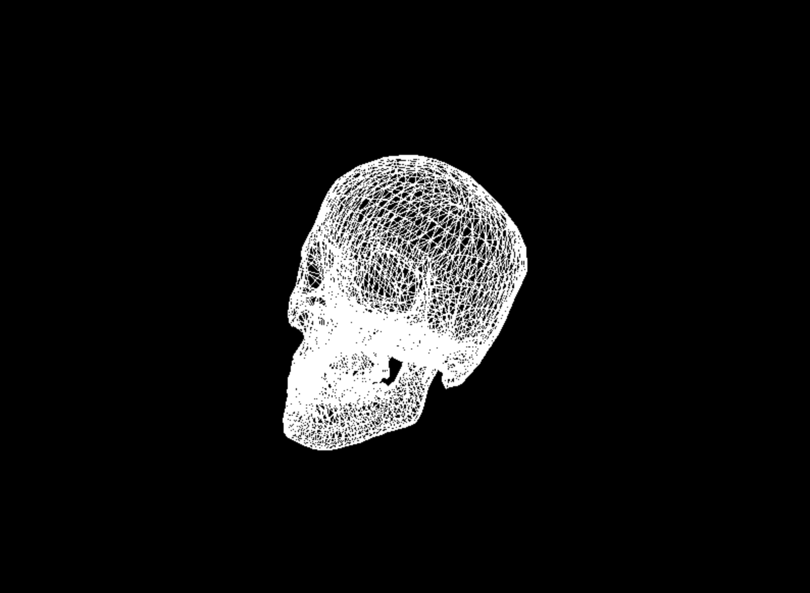
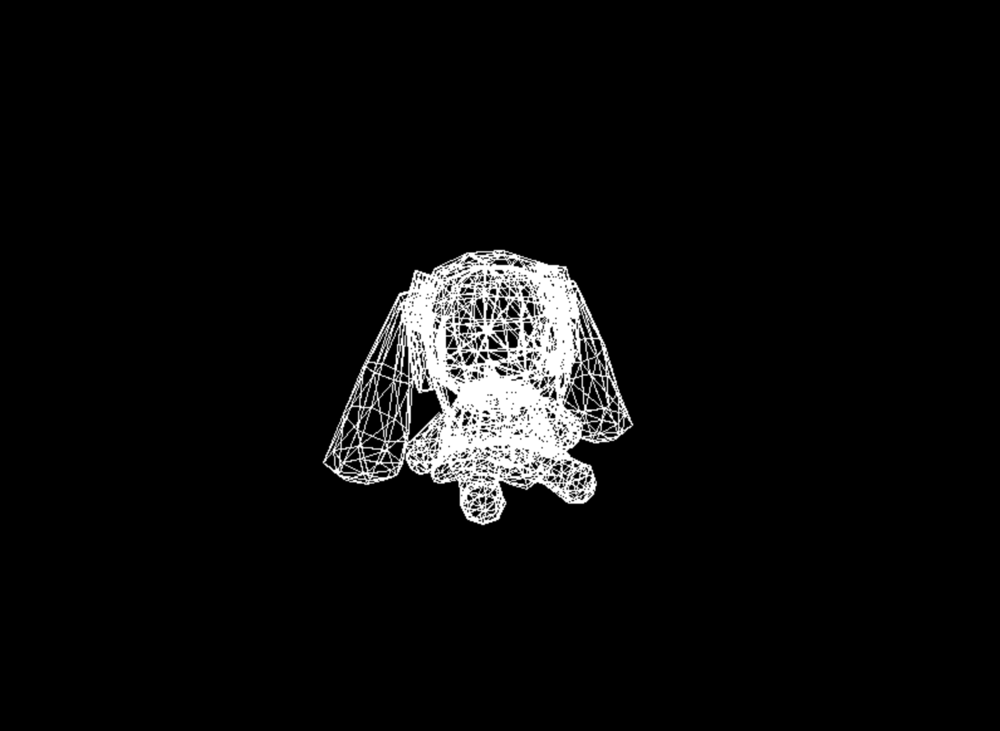

# CPU-Rasterizer
A CPU based rasterization rendering engine written in C, written in one day to as a quick test on my knowledge of the rasterization pipeline and concepts, it uses SDL for input and windowing.





## Roadmap
- Add multithreading performance for rendering vertices.
- Add support for textures etc. and shadows.
- Add ascii renderer for terminal use.

## Building
- Macos, run `compile.sh` or;
```
cmake -S . -B build
cmake --build build
```
- And run with;
```
./build/CPU-Rasterizer <path-to-model>
```
## Controls
- `W` wireframe mode.
- `F` filled mode.
- Rotate using `UP` `DOWN` `LEFT` `RIGHT`.

## Adjustments
- To adjust the location of the object, you will have to modify `Application.c` to change the application view by modifying the `make_translation` matrix, likewise, the projection can also be modified. (I will try expose this later)

## Process
The flow of the rasterizer first starts with loading the `.obj` file into the application, this data is stored for vertices as `vec3` and the indices representing the connections between a vertices, from there it is projected through the `model view` to the `world space` then to the `view space` and finally the `normalized device coordinates` through a series of transformation matrices, by this point the vertices are stored as a `ScreenVertex` which represent the 2D coordinate on the screen of the vertex and then the `Rasterizer` writes the data to a `Framebuffer` containing data for each pixel in the frame, the rasterizer uses bresenham linear interpolation to interpolate between the vertices and fill in the framebuffer, the framebuffer is then taken by the `SDL` objects and presented onto the screen.

## Credit
- Models are taken from the Ray Tracing in one weekend series by Peter Shirley.
- Hatsune Miku Plushie by revsworks on sketchfab.